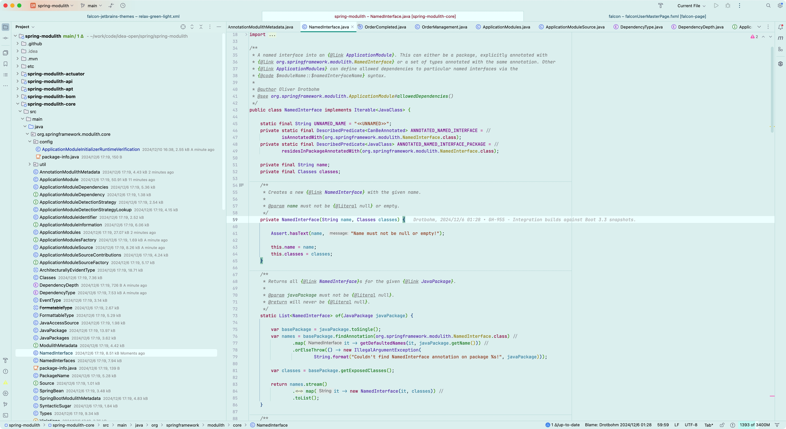

# Falcon Relax Eyes Themes for [JetBrains IDE](https://www.jetbrains.com/)

> A protect your eyesight theme for [JetBrains IDE](https://www.jetbrains.com/)

If you work in a bright environment for long periods of time, a light-colored theme is recommended.
  
Falcon Relax Eyes theme might be a better choice for you.

## Thanks

> 1. [Dracula Theme](https://plugins.jetbrains.com/plugin/12275-dracula-theme)
> 2. [Everest Theme](https://plugins.jetbrains.com/plugin/22653-everest-theme)
> 3. [JetBrains Light Theme](https://www.jetbrains.com/idea/)

## Source Code

1. [Gitee](https://gitee.com/panxiaoan/falcon-jetbrains-themes)
2. [Github](https://github.com/panxiaoan/falcon-jetbrains-themes)

## Screenshot

### Relax Green Light Colorful

### Relax Grey Light

### Relax Green Light

### Relax Green Light Contrast

## License

[MIT License](./LICENSE)

> Keep It Simple and Stupid.