# Falcon Relax Eyes Themes for [JetBrains IDE](https://www.jetbrains.com/)

> A protect your eyesight theme for [JetBrains IDE](https://www.jetbrains.com/)

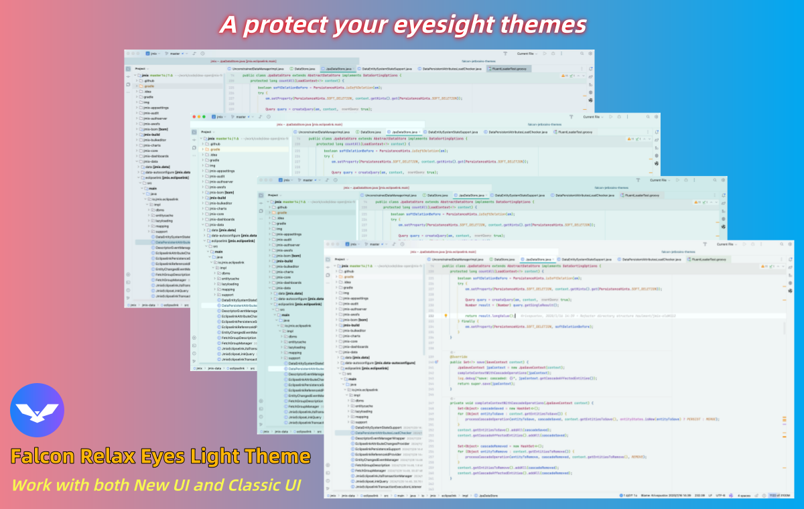

If you work in a bright environment for long periods of time, a light-colored theme is recommended.
 
Falcon Relax Eyes theme might be a better choice for you. 

在明亮的工作环境中，长时间使用 IDE，建议使用浅色主题，减少视觉疲劳。 

> <a href="https://ux.stackexchange.com/questions/53264/dark-or-white-color-theme-is-better-for-the-eyes">Dark or white color theme is better for the eyes?</a>
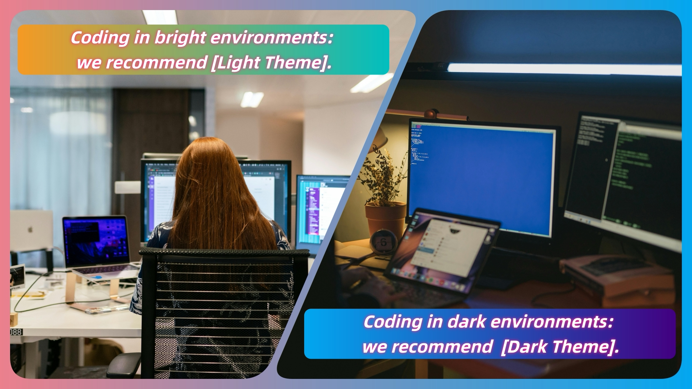

**Basic features in Falcon Relax Eyes Themes:**

- Work with both **New UI** and **Classic UI**
- Well-balanced colors, easy on eyes
- Better syntax highlight
- Unified and clean themes style
- Lightweight and low impact on IDE performance

**Falcon Relax Eyes Light themes (for bright environments):**

- Relax Celadon Light
- Relax Green Light
- Relax Green Light Contrast
- Relax Grey Light

**Falcon Relax Eyes Dark themes (for low-light environments):**

- Relax Dark
- Relax Dark Darcula
- Relax Dark Blue
- Relax Dark Green
- Relax Dark Violet

<b>For light themes, IDEA's default editor color scheme is also available:</b>
- Relax Celadon Light(IDEA default scheme)
- Relax Green Light(IDEA default scheme)
- Relax Green Light Contrast(IDEA default scheme)
- Relax Grey Light(IDEA default scheme)
- Relax Pink Light(IDEA default scheme)

<a href="https://github.com/panxiaoan/falcon-jetbrains-themes/issues">Report an issue</a>

## Install

[Jetbrains Marketplace](https://plugins.jetbrains.com/plugin/26026-falcon-relax-eyes-light-theme)

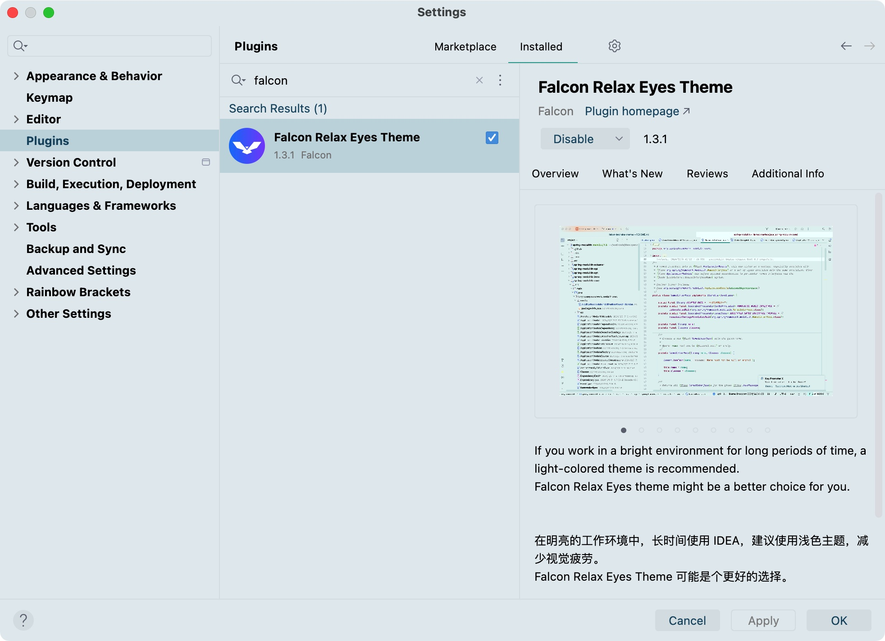

## Thanks

> 1. [Dracula Theme](https://plugins.jetbrains.com/plugin/12275-dracula-theme)
> 2. [Everest Theme](https://plugins.jetbrains.com/plugin/22653-everest-theme)
> 3. [JetBrains Light Theme](https://www.jetbrains.com/idea/)

## Source Code

1. [Gitee](https://gitee.com/panxiaoan/falcon-jetbrains-themes)
2. [Github](https://github.com/panxiaoan/falcon-jetbrains-themes)

## Falcon Relax Light Theme Screenshot

1. Relax Green Light

    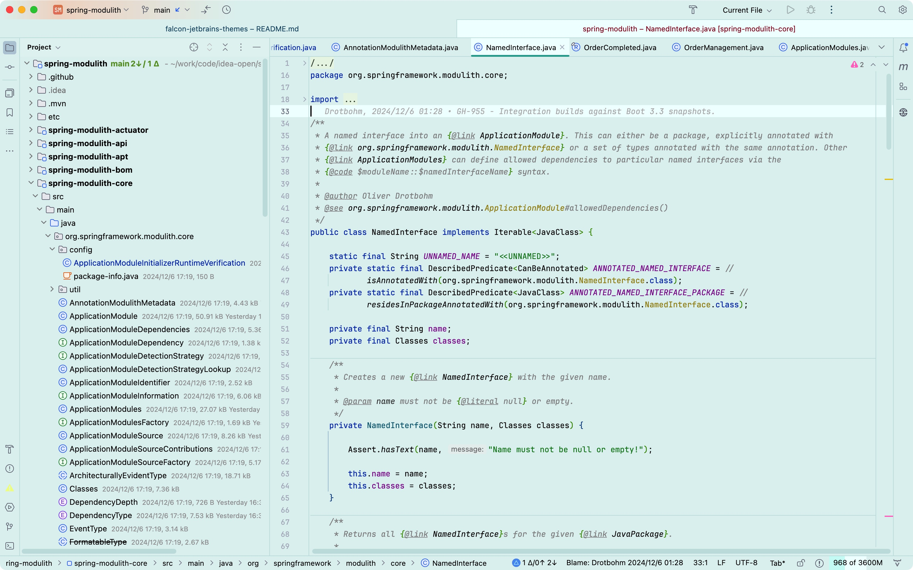

2. Relax Green Light Contrast

    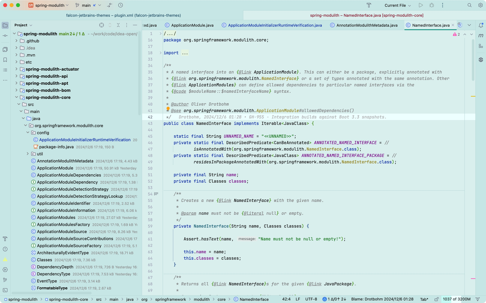

3. Relax Grey Light

    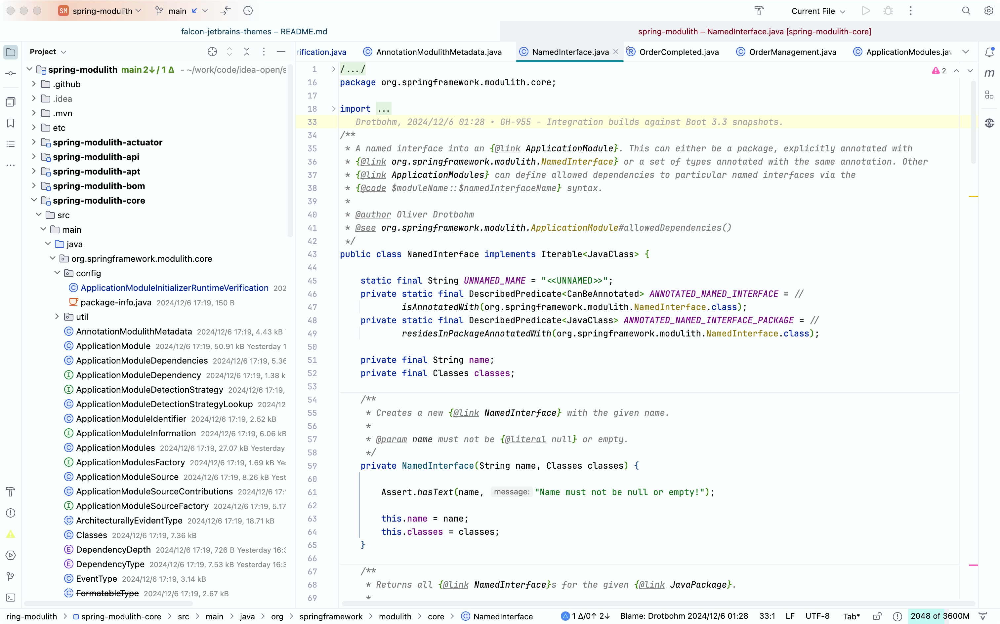

4. Relax Celadon Light

    

5. Relax Pink Light

    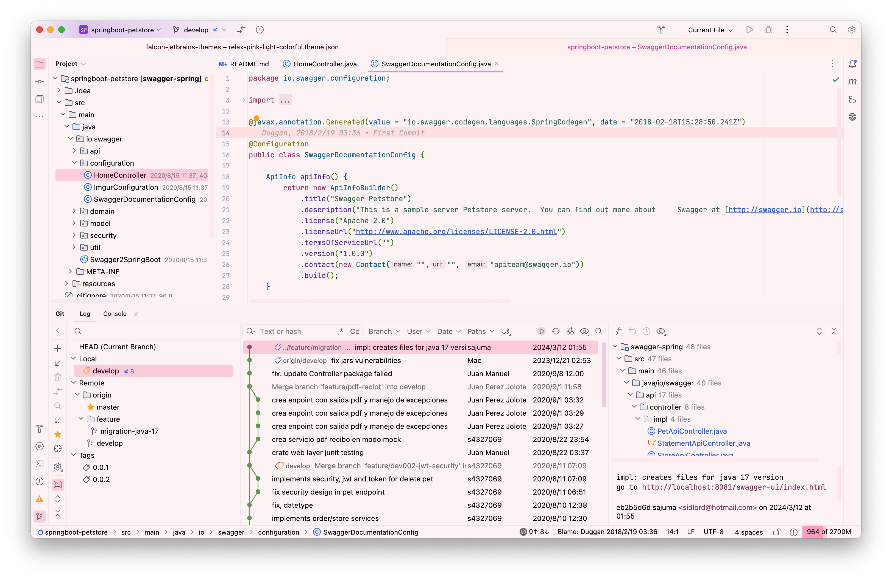

## Falcon Relax Dark Theme Screenshot

1. Relax Dark

    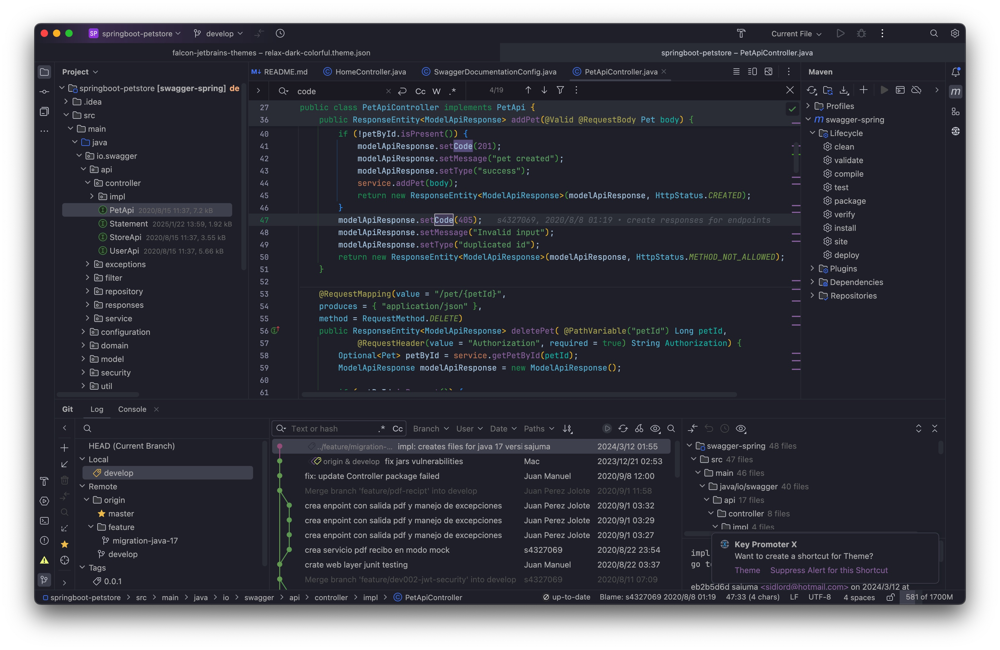

2. Relax Dark Darcula

    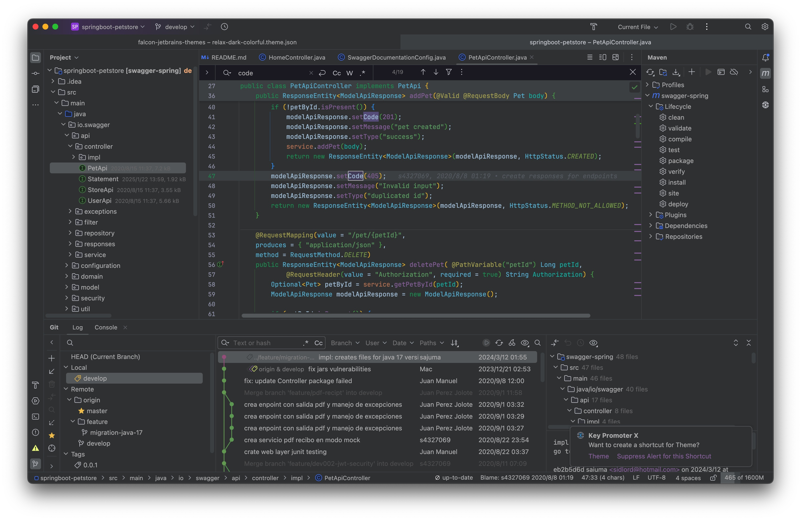

3. Relax Dark Blue

    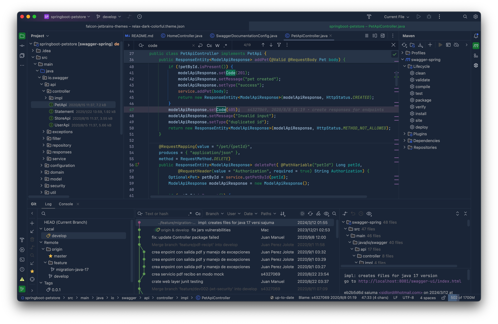

4. Relax Dark Green

    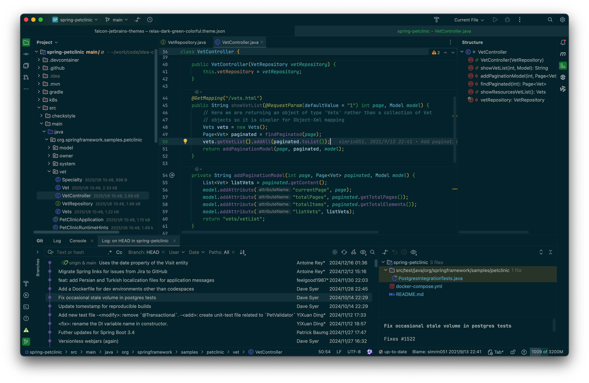

5. Relax Dark Violet

    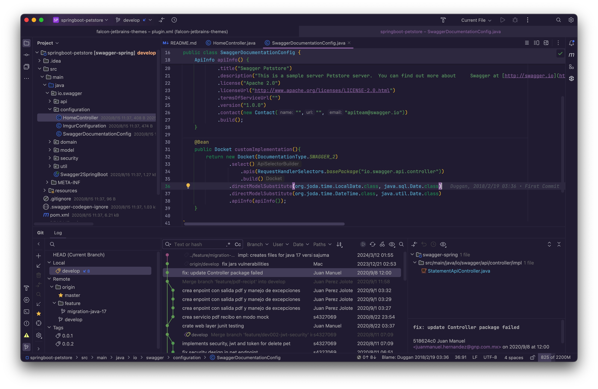

## License

[MIT License](./LICENSE)

> Keep It Simple and Stupid.