# Falcon Relaxing-Eyes Islands Themes for JetBrains IDE

<p>
   
</p>

> A gentle, eye-friendly theme to protect your eyesight for
> [JetBrains IDE](hhttps://plugins.jetbrains.com/plugin/26026) <br/>
> 一个温和的，对眼睛友好，保护视力的 JetBrains IDE 主题

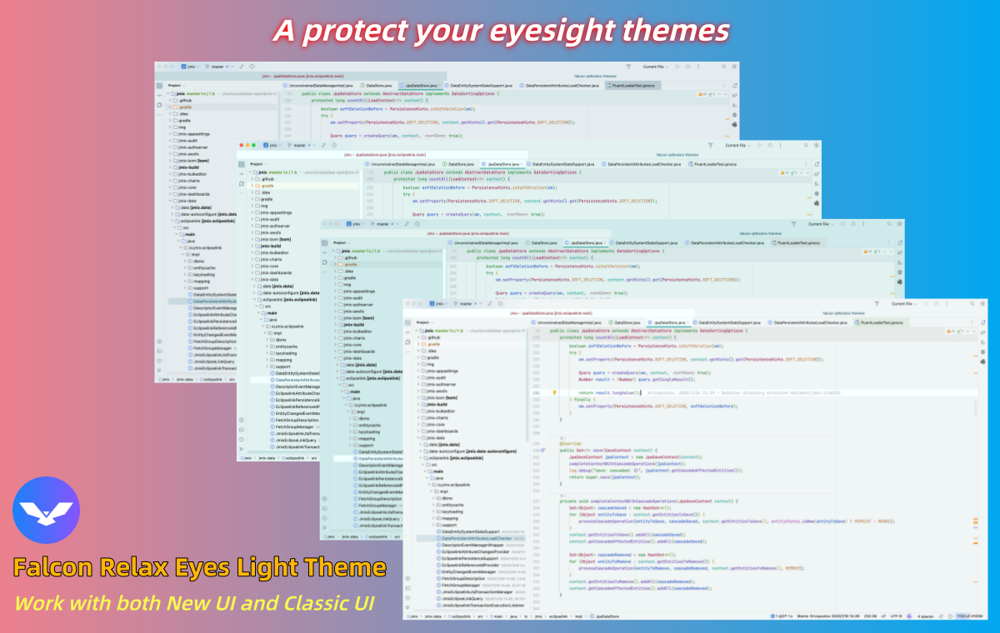

If you're working in a bright environment for extended periods, a light-colored theme is usually better.<br/>
You might want to try The Falcon Relaxing-Eyes themes.<br/>

在明亮的工作环境中，长时间使用 IDE，建议使用浅色主题，减少视觉疲劳。<br/>

<b>🔥🔥🔥从 6.0.0 版本开始支持 JetBrains Islands UI（2025.2+）</b> <br/>
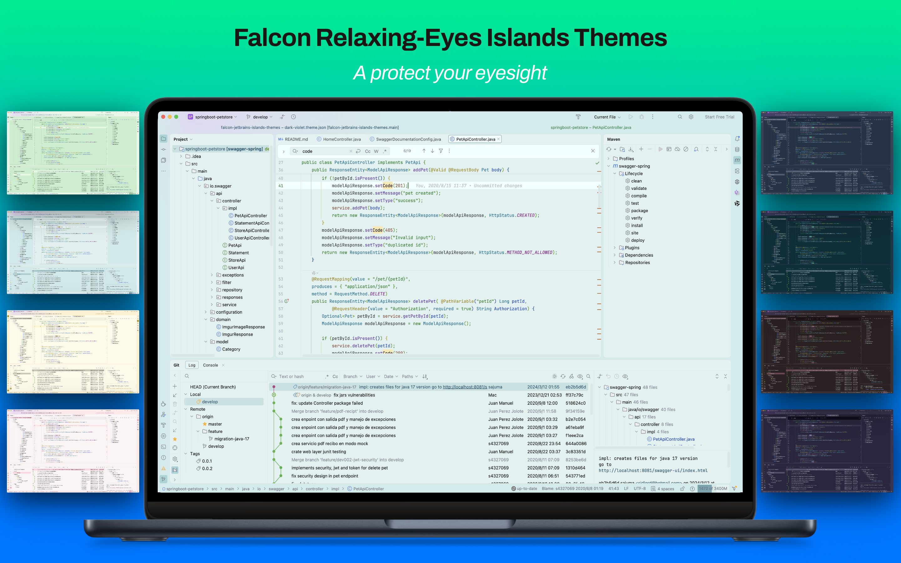

## Features

- 🌿 Gentle, eye-friendly colors to reduce strain
- ✨ Improved syntax highlighting for clarity
- 🎨 Consistent and clean theme style
- ⚡ Lightweight design with minimal impact on JetBrains IDEs - performance
- 🧠 Supports JetBrains IDE Islands(2025.2.3+) & New(2023.2+) & Classic UI
- 📦 Supports all JetBrains IDEs(IntelliJ IDEA/PyCharm/WebStorm/Android Studio/RubyMine/GoLand/DataGrip)

## Falcon Themes (Supports Islands UI)

**Islands Light themes (for bright environments):**

- Islands Relax Light Celadon (My favorite)
- Islands Relax Light Green
- Islands Relax Light Green Contrast
- Islands Relax Light Bean Green
- Islands Relax Light Grey
- Islands Relax Light Pink
- Islands Relax Light Yellow
- Islands Relax Light Buff

**Islands Dark themes (for low-light environments):**

- Islands Relax Dark
- Islands Relax Dark Darcula
- Islands Relax Dark Blue
- Islands Relax Dark Green
- Islands Relax Dark Violet
- Islands Relax Dark Coffee

## Falcon Themes (Supports New & Classic UI)

**Light themes (for bright environments):**

- Relax Light Celadon (My favorite)
- Relax Light Green
- Relax Light Green Contrast
- Relax Light Bean Green
- Relax Light Grey
- Relax Light Pink
- Relax Light Yellow
- Relax Light Buff

**Dark themes (for low-light environments):**

- Relax Dark
- Relax Dark Darcula
- Relax Dark Blue
- Relax Dark Green
- Relax Dark Violet
- Relax Dark Coffee

## Install

```plain text
⚠️ Minimum supported IDEA version: 2023.2
```

👉 [Download from Jetbrains Marketplace](https://plugins.jetbrains.com/plugin/26026)

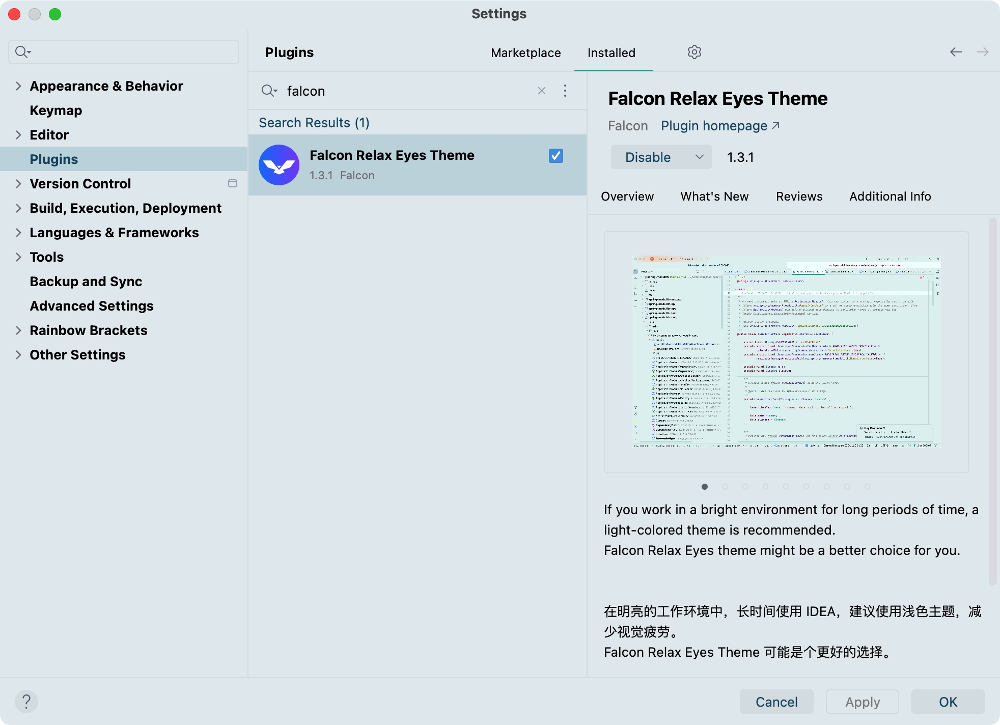

## Suggestion

Recommended font:

- [JetBrains Mono](https://www.jetbrains.com/zh-cn/lp/mono/)
- Font size: 13
- Line spacing: 1.2
- Fallback font: `Microsoft YaHei`、`PingFang SC`, 备用字体建议中文支持更友好的字体

## Source Code

- [Gitee](https://gitee.com/panxiaoan/falcon-jetbrains-themes)
- [Github](https://github.com/panxiaoan/falcon-jetbrains-themes)

## Issues

Found a bug or have a suggestion? <a href="https://github.com/panxiaoan/falcon-jetbrains-themes/issues">Report an issue</a>

## License

See [MIT License](./LICENSE) for detailed instructions.

## Falcon Themes for VS Code, Zed

Using **VS Code?** You can also experience the same theme there.

👉 [Download from VS Code Marketplace](https://marketplace.visualstudio.com/publishers/panxiaoan)

Using **Zed?** You can also experience the same theme there.

👉 [Download from Zed Extensions](https://github.com/panxiaoan/falcon-zed-themes/blob/main/INSTALL.md)

## Islands Light themes Screenshot

1. Islands Relax Light Green

    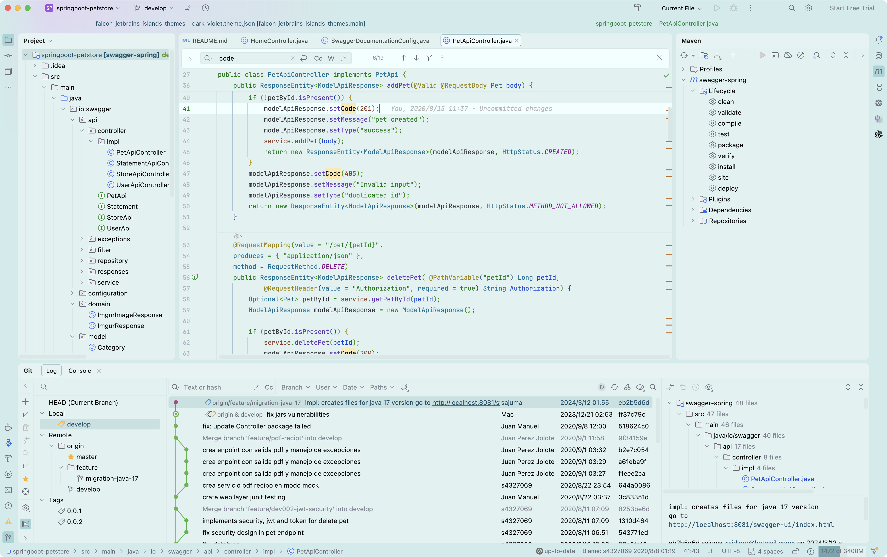

2. Islands Relax Light Green Contrast

    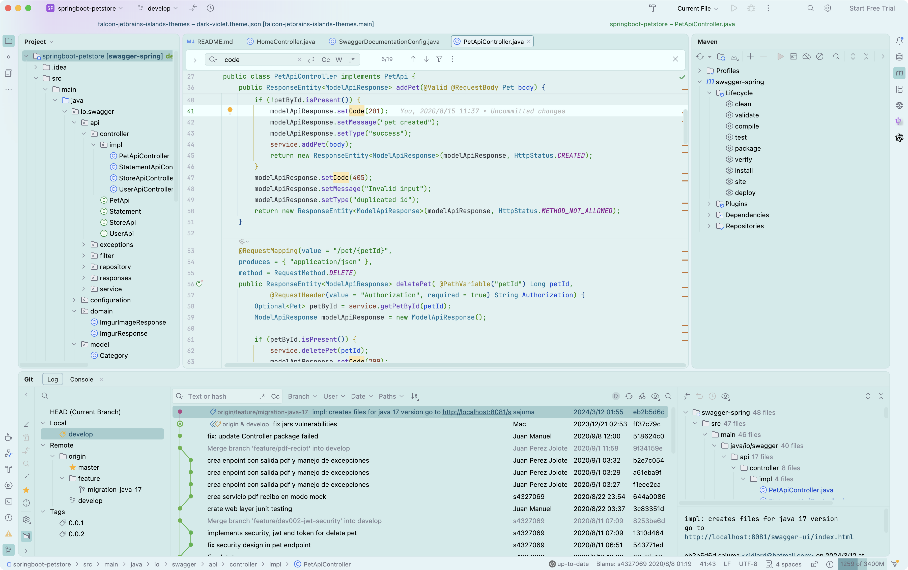

3. Islands Relax Light Grey

    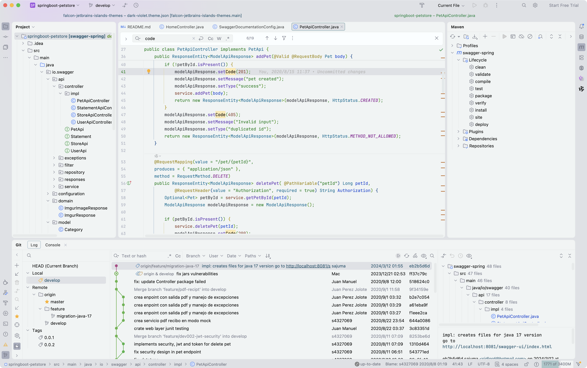

4. Islands Relax Light Celadon

    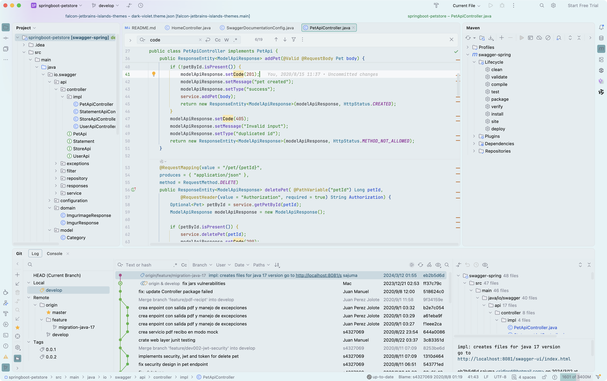

5. Islands Relax Light Pink

    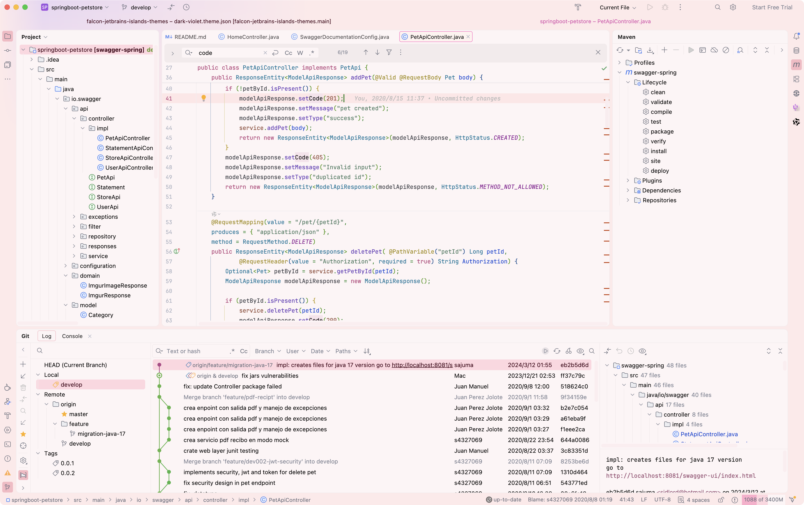

6. Islands Relax Light Yellow

    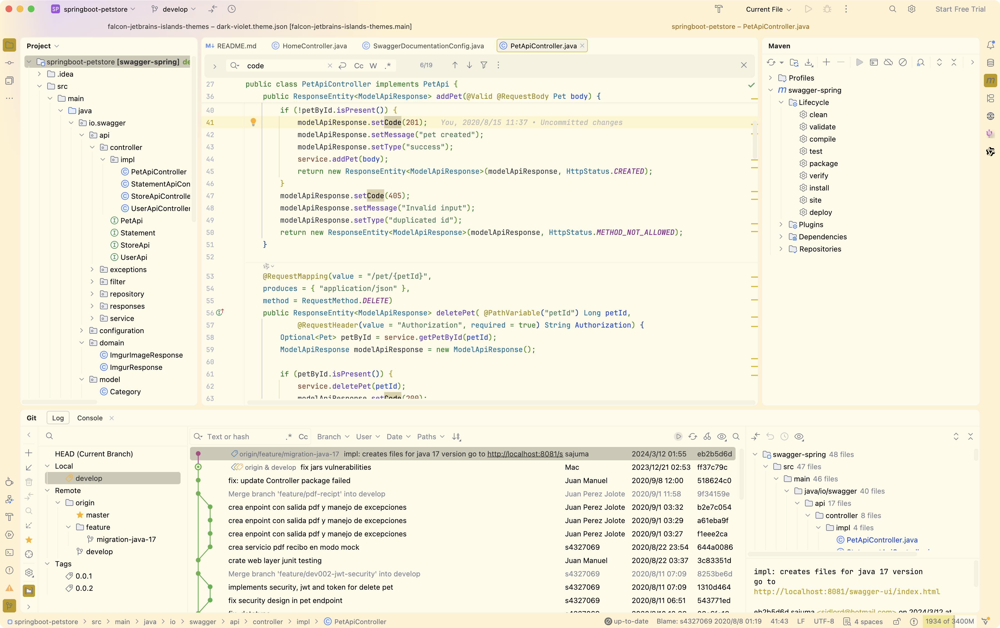

7. Islands Relax Light Buff

    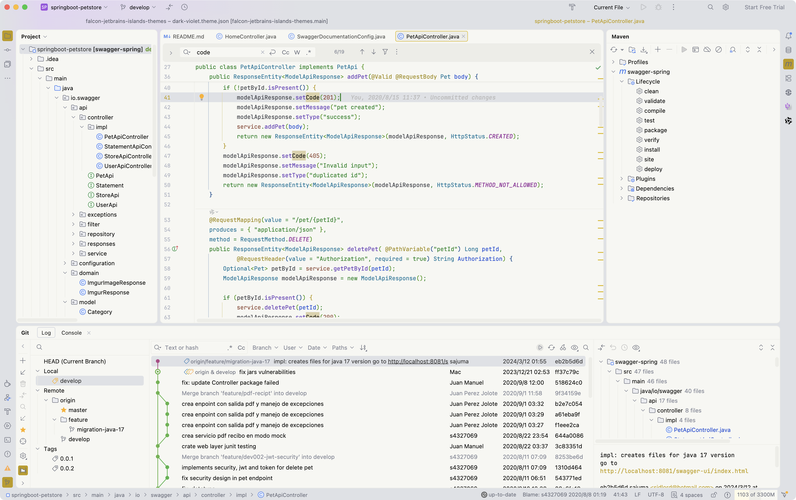

8. Islands Relax Light Bean Green

    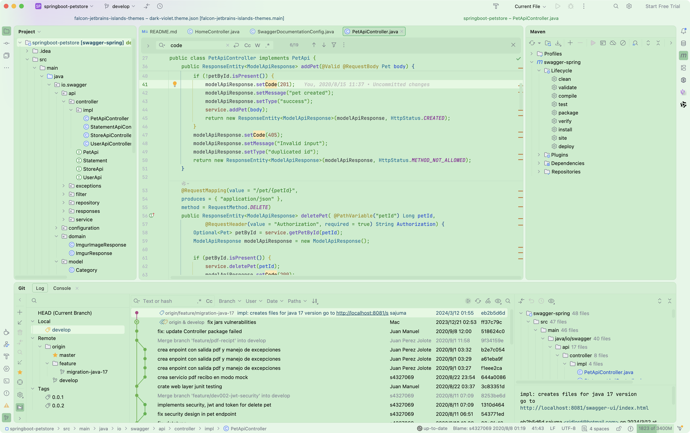

## Islands Dark themes Screenshot

1. Islands Relax Dark

    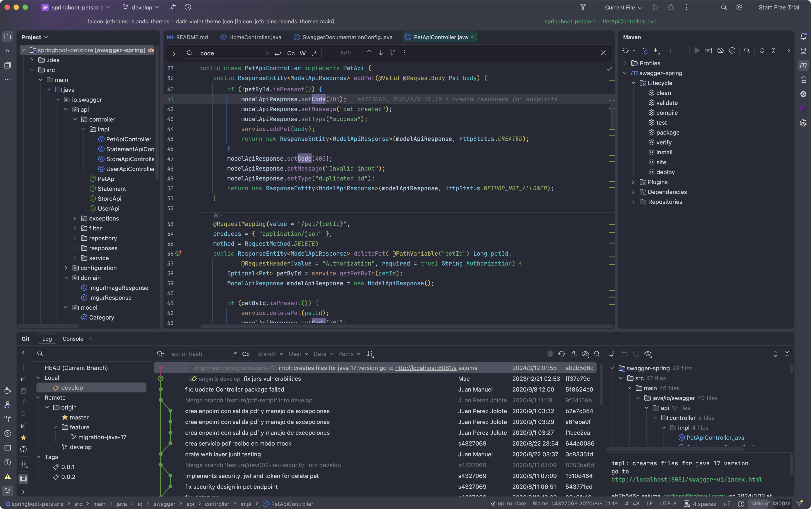

2. Islands Relax Dark Darcula

    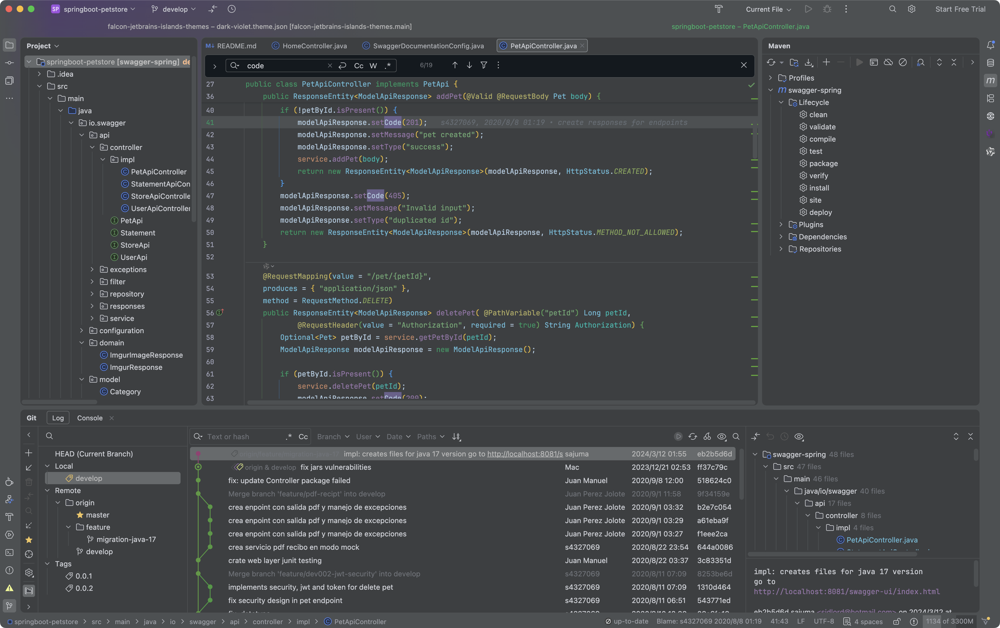

3. Islands Relax Dark Blue

    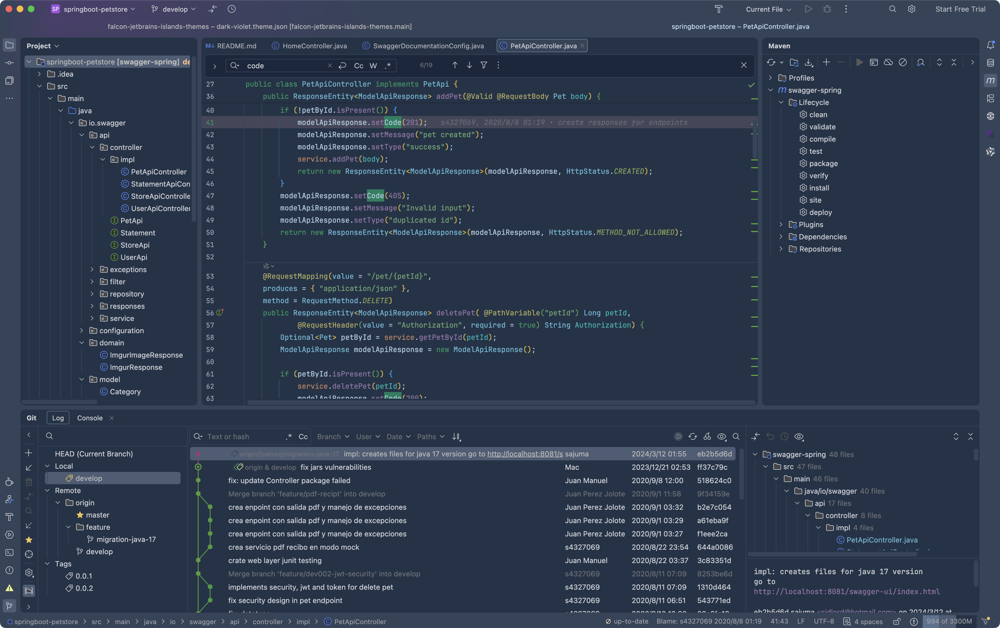

4. Islands Relax Dark Green

    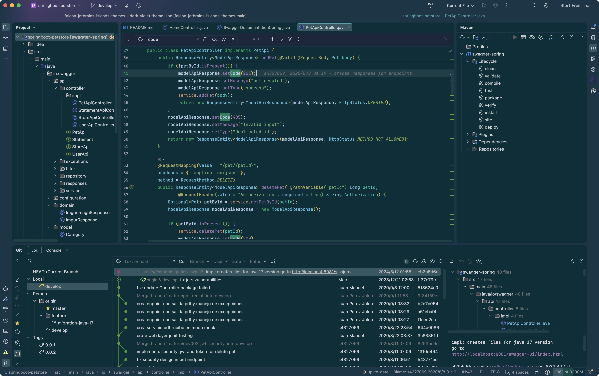

5. Islands Relax Dark Violet

    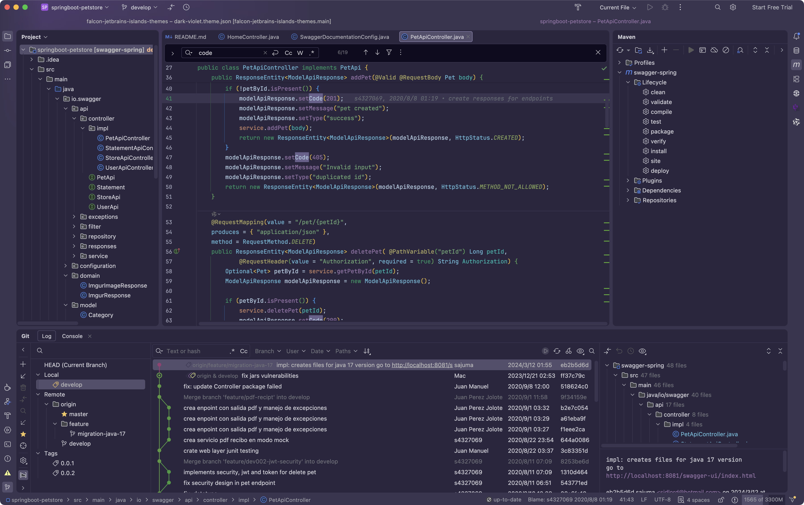

6. Islands Relax Dark Coffee

    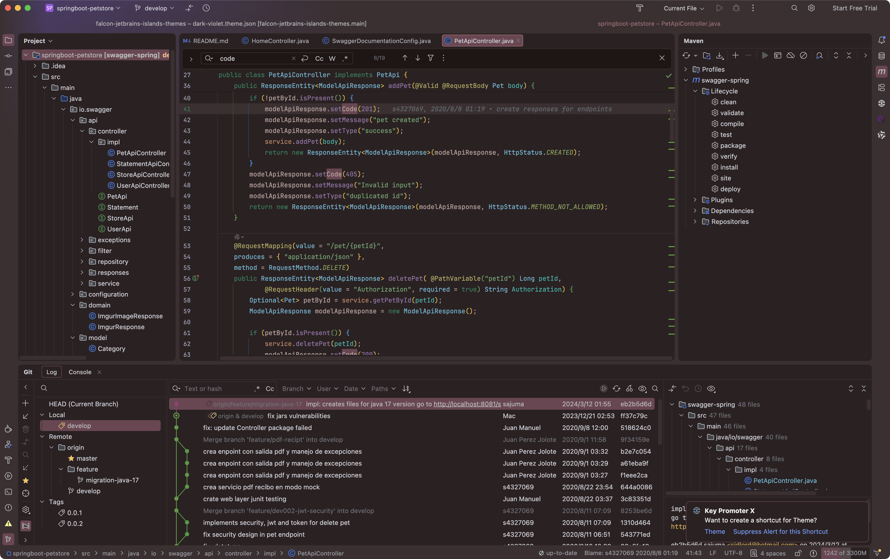