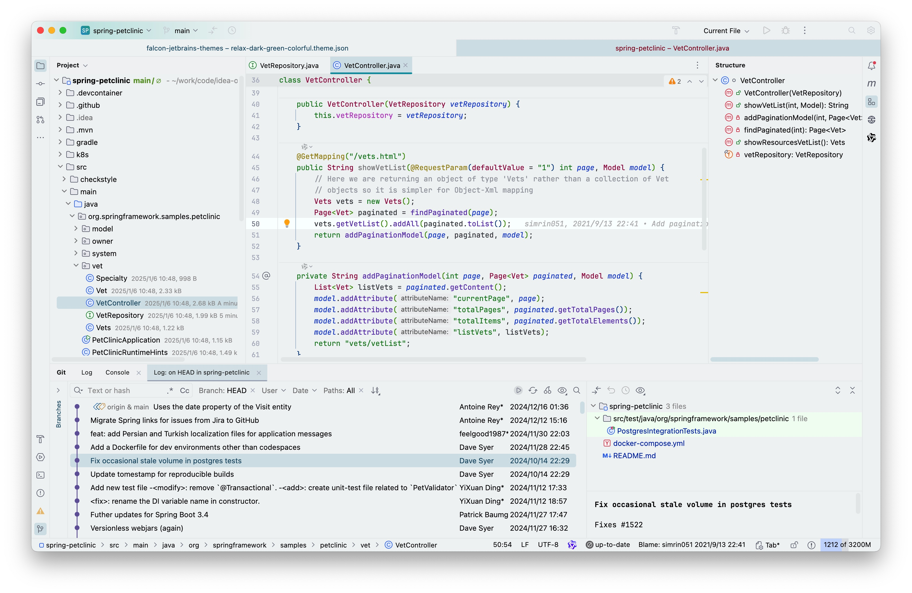

# Falcon Relax Eyes Themes for [JetBrains IDE](https://www.jetbrains.com/)

> A protect your eyesight theme for [JetBrains IDE](https://www.jetbrains.com/)

If you work in a bright environment for long periods of time, a light-colored theme is recommended.
 
Falcon Relax Eyes theme might be a better choice for you. 

在明亮的工作环境中，长时间使用 IDE，建议使用浅色主题，减少视觉疲劳。 

> <a href="https://ux.stackexchange.com/questions/53264/dark-or-white-color-theme-is-better-for-the-eyes">Dark or white color theme is better for the eyes?</a>

**Basic features in Falcon Relax Eyes Themes:**

- Work with both **New UI** and **Classic UI**
- Well-balanced colors, easy on eyes
- Better syntax highlight
- Unified and clean themes style
- Lightweight and low impact on IDE performance

**Falcon Relax Eyes Light themes (for bright environments):**

- Relax Celadon Light Colorful
- Relax Green Light
- Relax Green Light Colorful
- Relax Green Light Contrast
- Relax Green Light Contrast Colorful
- Relax Grey Light
- Relax Grey Light Colorful

**Falcon Relax Eyes Dark themes (for low-light environments):**

- Relax Dark Green Colorful
- Relax Dark Colorful

<a href="https://github.com/panxiaoan/falcon-jetbrains-themes/issues">Report an issue</a>

## Install

[Jetbrains Marketplace](https://plugins.jetbrains.com/plugin/26026-falcon-relax-eyes-light-theme)

## Thanks

> 1. [Dracula Theme](https://plugins.jetbrains.com/plugin/12275-dracula-theme)
> 2. [Everest Theme](https://plugins.jetbrains.com/plugin/22653-everest-theme)
> 3. [JetBrains Light Theme](https://www.jetbrains.com/idea/)

## Source Code

1. [Gitee](https://gitee.com/panxiaoan/falcon-jetbrains-themes)
2. [Github](https://github.com/panxiaoan/falcon-jetbrains-themes)

## Screenshot

1. Relax Green Light Colorful

    

2. Relax Green Light Contrast Colorful

    

3. Relax Grey Light Colorful

    

4. Relax Celadon Light Colorful

    

5. Relax Dark Green Colorful

    

6. Relax Dark Colorful

    

## License

[MIT License](./LICENSE)

> Keep It Simple and Stupid.